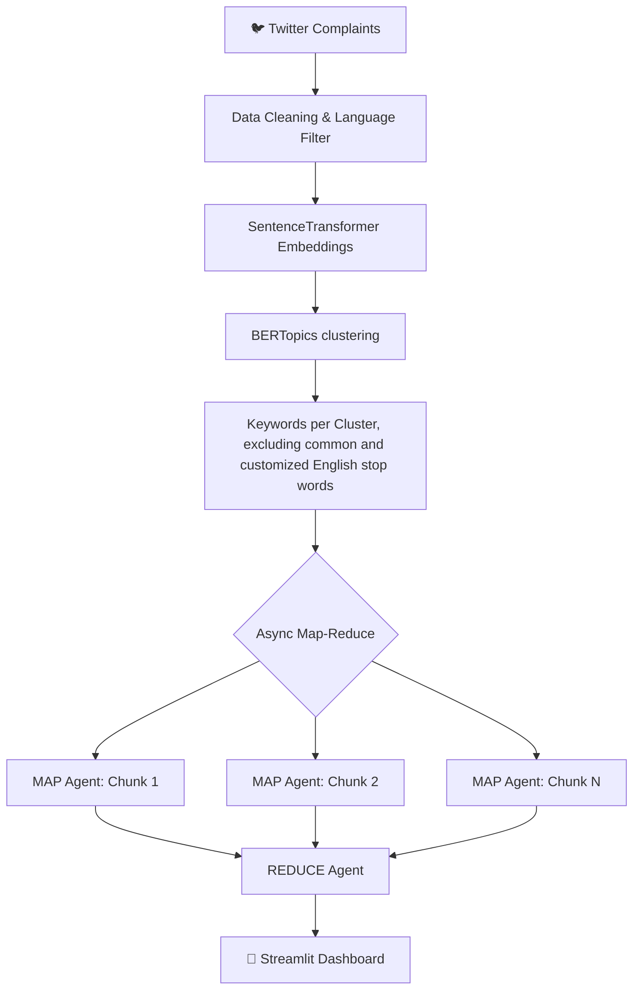

# 🎯 Customer Support Complaint Intelligence

AI-powered complaint analysis pipeline using Gemini + Async Map-Reduce Agents.

## 🔗 Live Demo
👉 [View Dashboard](https://customer-support-llm-agent-dygkzywxdkncqsbe66nkvj.streamlit.app/)

## 🏗️ Architecture

## 📁 Structure
| File | Description |
|------|-------------|
| `app.py` | Streamlit dashboard |
| `requirements.txt` | Dependencies |
| `notebook/Support_Ticket_agent.ipynb` | Full pipeline notebook |
| `data/cluster_analysis.csv` | Per-cluster LLM analysis |
| `data/final_report.json` | Executive report |
| `data/df_sample.csv` | Sample complaints |

## 🔧 Tech Stack
- **Gemini 2.5 Flash** — LLM analysis
- **Async Map-Reduce** — parallel agent calls to avoid token limits
- **SentenceTransformer** — complaint embeddings
- **BERTopics** — optimal clustering and keywords extraction
- **Streamlit + Plotly** — interactive dashboard

## 📊 Output
- Top complaint clusters ranked by volume
- Severity classification (High / Medium / Low)
- Root cause analysis
- Prioritized recommendations
- Sample complaints per cluster
